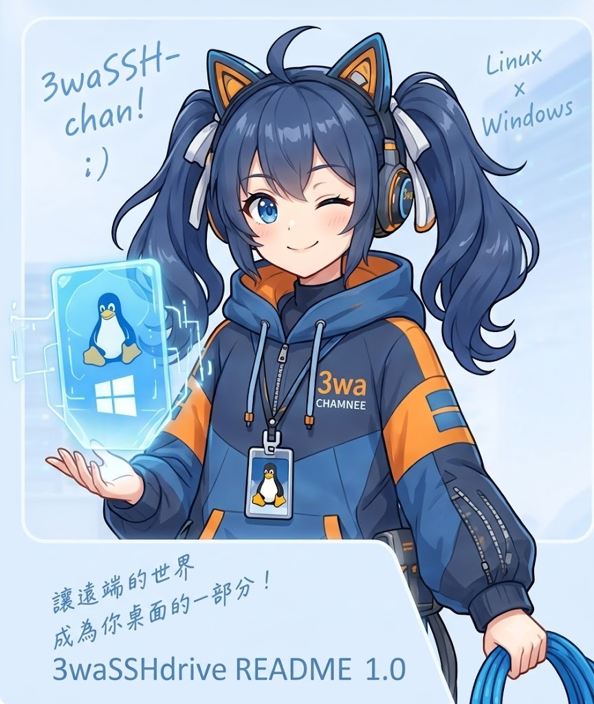
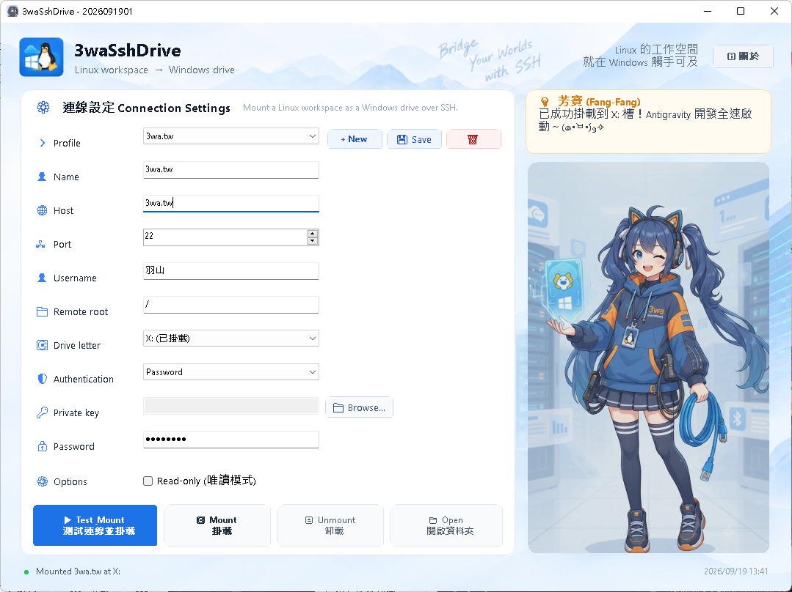

# 3waSshDrive

<div align="center">



**「讓遠端的世界，成為你桌面的一部分！」**  
*Project a remote Linux workspace into Windows as a native drive letter through WinFsp and SFTP.*

[](LICENSE)
[](README.md)
[](README.md)
[](https://github.com/winfsp/winfsp)

</div>

---

## 🌟 簡介 (Introduction)

**3waSshDrive** 是專為工程師與 AI 協同開發（如 Antigravity、VS Code）打造的高效能工具。透過 **WinFsp** 原生檔案系統驅動與 **SFTP** 協定，直接將遠端 Linux 工作空間（例如 `/home/dev/project`）映射為 Windows 磁碟代號（如 `Z:`）。

不需透過 `cmd.exe`、不呼叫外部 `net use`，亦無需安裝肥重的第三方中介軟體。在 Windows 檔案總管、編輯器、Diff 工具或終端機中，即可享有原生磁碟等級的流暢操作體驗。

<div align="center">



</div>

---

## ✨ 核心特色 (Key Features)

- ⚡ **完整讀寫與極速快取 (Full Read/Write & Metadata Cache)**
  - 支援完整檔案讀取、建立、覆寫、重新命名與刪除。
  - 內建高效能 LRU Metadata 快取，大幅縮減 Windows 檔案總管瀏覽深層目錄的 SFTP 延遲。
  - 支援「唯讀模式 (Read-only)」保護選項，防止重要伺服器環境被誤修改。

- 🛡️ **資安防護與防偽 (Security & MITM Protection)**
  - 嚴格的 **SHA-256 主機指紋 (Host Key Fingerprint)** 校驗流程，杜絕中間人攻擊（MITM）。
  - 支援 **SSH 私鑰 (Private Key)** 與 **密碼 (Password)** 驗證。
  - 密碼僅保留於記憶體中，絕不落盤儲存；設定檔僅記錄連線配置與私鑰路徑。

- 🔄 **斷線自動重連 (Disconnect Auto-Reconnect)**
  - **底層透明重試**：若檔案操作中途遭遇網路瞬斷，自動重新連線並重試該操作，避免拋出 `DEVICE_NOT_READY`。
  - **背景守護心跳**：10 秒定時探測連線健康度，WiFi 切換或網路恢復時自動重新掛載，系統匣同步跳出氣泡通知。

- 💽 **智慧槽位偵測 (Smart Drive Letter Detection)**
  - 自動偵測系統實體硬碟、虛擬光碟與現有網路磁碟，於下拉選單清楚標示 `(已掛載)`，防止槽位碰撞與覆蓋。

- 📋 **未預期異常崩潰日誌 (Crash Logger)**
  - 全方位攔截 UI 執行緒、AppDomain 與 TaskScheduler 異常。
  - 採用標準 PHP 日期格式儲存於 `log/Ymd.txt`（如 `log/20260919.txt`），當天多筆異常自動以附加模式 (Append) 完整保留 StackTrace。

- ☕ **系統匣常駐 (System Tray Mode)**
  - 點選視窗關閉按鈕預設最小化至右下角系統匣，背景安靜守護連線，不佔用工作列空間。

- 💡 **看板娘：芳寶 (Fang-Fang)**
  - 內建精緻流暢的滿版動畫看板娘，陪伴您的編程時光。
  - 具備連線狀態即時反饋、斷線加油打氣與多種趣味對話！

---

## 💻 系統需求 (Prerequisites)

1. **作業系統**：Windows 10 或 Windows 11 (x64)
2. **執行環境**：[.NET Framework 4.7.2](https://dotnet.microsoft.com/en-us/download/dotnet-framework/net472)
3. **檔案系統驅動**：[WinFsp v2.1](https://github.com/winfsp/winfsp/releases/tag/v2.1)（程式內建一鍵透過 `winget` 自動安裝按鈕）
4. **遠端伺服器**：支援 SSH/SFTP 的 Linux 主機

---

## 🚀 快速開始 (Quick Start)

### 1. 取得原始碼 (含 Submodules)

```powershell
git clone --recurse-submodules https://github.com/shadowjohn/3waSshDrive.git
cd 3waSshDrive
```

### 2. 一鍵建置與執行 (懶人腳本)

- 雙擊 **`build.bat`**：自動還原依賴、執行全套單元測試並編譯 Release 版本。
- 雙擊 **`run.bat`**：直接啟動應用程式。

也可以在命令提示字元或 PowerShell 直接執行：

```bat
build.bat
run.bat
run.bat --check
```

`run.bat --check` 會啟動真正的 `3waSshDrive.exe --self-check`、等待完成並傳回相同的 exit code；檢查過程不連線 SSH，也不要求 WinFsp 已安裝。

### 3. 命令列建置 (Command Line)

```powershell
dotnet restore .\3waSshDrive.sln
dotnet test .\3waSshDrive.sln -c Release --no-restore
dotnet build .\src\3waSshDrive.App\3waSshDrive.App.csproj -c Release --no-restore
```

執行檔產出路徑：
```text
src\3waSshDrive.App\bin\Release\net472\3waSshDrive.exe
```

---

## 📦 CI 產物與正式發行 (Artifacts & Releases)

一般 push 與 pull request 通過 Windows build 後，Actions 會提供 `3waSshDrive-win-x64-<short-sha>.zip` 與對應的 `.sha256`。這份 ZIP 是免安裝的測試／驗收產物，不是正式安裝或自動更新的基礎。

正式版本使用 `vYYYY.MM.DD.RR` tag；同一天的 `RR` 可由 `01` 遞增至 `99`。例如：

```bat
git tag v2026.09.19.01
git push origin v2026.09.19.01
```

tag workflow 會建立 Velopack 1.2.0 的 x64、per-user 安裝包，先保持 GitHub Release 為 draft，完成資產檢查、乾淨安裝、EXE self-check、版本核對與解除安裝後才發布。正式下載入口是 `3waSshDrive-Setup.exe`，預設安裝位置為：

```text
%LocalAppData%\3waSshDrive
```

WinFsp 不會包進 Setup；它是另外下載並驗證的必要元件，程式內的輔助安裝會固定要求 WinFsp `2.1.25156`。若維護者沒有設定簽章憑證，產生 unsigned Release 是預期且受支援的流程。Microsoft Security Intelligence 線上送檢由維護者在下載正式產物後手動進行，不在 GitHub Actions 內，也不阻擋發版。

---

## 🔄 應用程式內更新 (In-App Updates)

- 只有透過 `3waSshDrive-Setup.exe` 安裝的版本會從穩定版 GitHub Release feed 檢查並套用更新。Portable ZIP／未受管理的執行檔不會原地更新；請另行下載 Setup，之後才能使用自動更新。
- 程式顯示後會在背景做一次非阻塞檢查。離線或 GitHub 暫時無法連線時不會跳出錯誤，也不會影響既有掛載與一般操作。
- 可從主畫面右上角「檢查更新」或系統匣選單手動檢查。手動檢查會回報已是最新版、portable／未安裝模式或安全的失敗訊息。
- 找到新版時，視窗會列出目前版本、目標版本與 release notes。「稍後」會保持目前版本繼續執行，已掛載磁碟不受影響；「更新」會先下載並驗證套件，再停止自動重連、安全卸載所有由程式掛載的磁碟，最後安裝並重新開啟程式。
- 任何下載、驗證、卸載失敗或卸載逾時都會取消套用並保留目前版本；尚未安全卸載完成時絕不替換程式。啟動、主畫面與系統匣共用同一個 update session，不會同時跑多份更新。
- 應用程式更新不會安裝或升級 WinFsp。WinFsp 仍由程式內的獨立輔助安裝功能固定下載並驗證。
- 更新診斷只記錄操作名稱、例外類型與 HRESULT；不寫入密碼、token、SSH host 或私鑰路徑等連線細節。

---

## 📖 使用教學 (Usage Walkthrough)

1. **建立連線設定檔 (Profile)**：
   - 輸入設定檔名稱、主機 IP / Domain、SSH Port (預設 22) 與登入帳號。
   - 設定遠端根目錄（如 `/home/john` 或 `/var/www/html`）。
   - 選擇登入方式（私鑰路徑或輸入密碼）。
   - 選擇欲掛載的 Windows 磁碟代號（如 `Z:`）。
2. **測試並信任 (Test & Trust)**：
   - 點擊「**▶ Test Mount (測試連線並掛載)**」或「**Test & Trust**」。
   - 系統會連線並自動擷取遠端伺服器的 SHA-256 主機指紋進行防偽綁定。
3. **掛載磁碟機 (Mount)**：
   - 點擊「**🖹 Mount (掛載)**」，成功後狀態燈轉為綠色 `●`。
4. **開啟工作空間 (Open Explorer)**：
   - 點擊「**📁 Open (開啟資料夾)**」，Windows 檔案總管立即展開該磁碟機。
   - 您可以直接在 VS Code、Antigravity 或任何編輯器中將該磁碟槽當作本機磁碟開啟與存檔！
5. **卸載 (Unmount)**：
   - 點擊「**⏏ Unmount (卸載)**」即可安全釋放磁碟槽。

---

## 🧪 Benchmark / Torture Test

scripts\Test-3waSshDrive.ps1 直接透過 Windows 檔案 API 對已掛載的 3waSshDrive 磁碟做實測：碎檔建立與讀取、100 MiB／1 GiB 循序寫入及讀回、目錄 stat、檔案 rename/delete、IDE/Git 型混合操作，以及本機→掛載碟→本機的 SHA-256 完整性驗證。

預設是 dry run，不會建立或修改任何檔案：

    pwsh -NoProfile -File .\scripts\Test-3waSshDrive.ps1 -TargetRoot T:\

確認掛載設定檔可寫，並選擇可安全清理的目標後，才加上 -Apply：

    pwsh -NoProfile -File .\scripts\Test-3waSshDrive.ps1 -TargetRoot T:\ -Apply -ReportPath C:\Temp\3waSshDrive-benchmark.json

預設規模為 5,000 個 1–32 KiB 檔案、100 MiB 與 1 GiB 循序檔、1,000 個目錄、1,000 次檔案 rename、2,000 次混合操作與 64 MiB SHA-256 驗證；可用 -SmallFileCount 10000 等參數放大。每次只會在 TargetRoot 下建立帶有 RunId 與 marker 的專用測試樹，成功時預設自動移除；失敗或指定 -KeepArtifacts 時會保留現場供追查。

---

## 📁 設定檔與紀錄檔位置 (Storage & Logs)

- **連線設定檔 (Profiles)**：
  ```text
  %APPDATA%\3waSshDrive\profiles.json
  ```
- **異常崩潰日誌 (Crash Logs)**：
  ```text
  log\YYYYMMDD.txt (例：log\20260919.txt)
  ```

---

## 👥 關於與版權資訊 (About & License)

- **專案名稱**：3waSshDrive
- **作者 (Author)**：羽山秋人 (shadowjohn)
- **團隊**：3WA 問題解決專家工作室
- **聯絡信箱**：linainverseshadow@gmail.com
- **專案原始碼**：[https://github.com/shadowjohn/3waSshDrive](https://github.com/shadowjohn/3waSshDrive)
- **看板娘**：芳寶 (Fang-Fang / 3WA-chan)
- **授權協議**：[GNU General Public License v3.0 (GPLv3)](LICENSE)

---

<div align="center">
  <sub>Linux × Windows = More Freedom. Made with 💙 by 3WA Studio.</sub>
</div>
